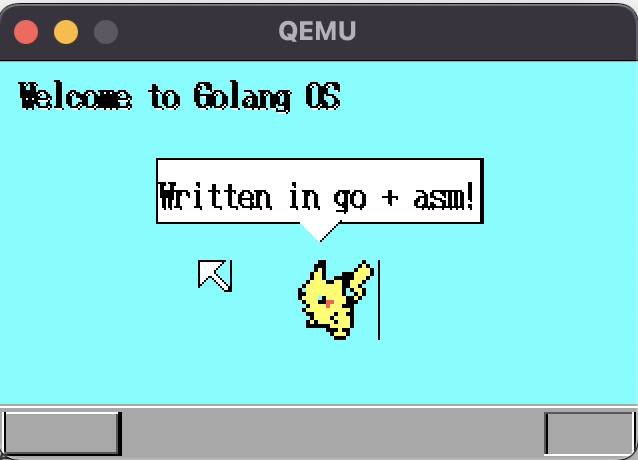

# go-graphic-os

This is a graphic mode kernel written in go,
based on the [Bare Metal Gophers](https://github.com/achilleasa/bare-metal-gophers) repository.

The detailed description of the code is written in [this Medium blog](https://medium.com/@reishim0731/writing-a-32-bit-graphic-mode-kernel-in-golang-d113b8e59720).

## How it looks

The kernel currently looks like this (you can't move the mouse yet.):

## Future work needed

Some of our future work include

- fixing the weird vertical line next to the mouse and Pikachu
- adding interrupts so that the kernel can receive signals from the keyboard and mouse
- we currently can only print out byte arrays, which means that printing numbers on the screen won't work. We need to prepare a function to convert numbers to byte arrays

Merge requests are welcome!

====================================================================

Below is basically the same readme as the original repository.

## Requirements 

The project Makefile contains targets for building a bootable ISO containing
the compiled code. [Virtualbox](https://www.virtualbox.org/) or [qemu](http://www.qemu-project.org/)
can be used to boot the generated ISO (`make run-qemu` or `make run-vbox`). A 
debugging target is also provided (`make gdb`) that boots the ISO using qemu 
and then spawns an interactive gdb session. 

The code was developed using Go 1.8. However, you should be able to compile it
with any Go version that supports native cross-compilation.

## Building on Linux

To compile the demo code when running on Linux you need a fairly recent version of:

- xorriso
- grub
- nasm 
- gcc (for GNU ld)
- go (1.6+; recommended: 1.8)
- gdb (optional; only install if you want to debug the demo code)

The above dependencies can be installed using the appropriate package manager 
for each particular Linux distribution.

## Building on OSX

To properly link the kernel object files so that the bootloader can pick up the 
multi-boot signature we need to be able to control the linker configuration. For
the time being this is only possible when using GNU ld ([lld](https://lld.llvm.org/) 
is a potential alternative but doesn't yet fully support linker scripts).

You can still build the kernel using [vagrant](https://www.vagrantup.com/). For
this purpose, a Vagrantfile is provided so all you need to do is just install 
vagrant on your machine and run `vagrant up` before running any of the following 
make commands.

To debug the demo code, you need to install gdb. If using
[brew](https://brew.sh/) you can do this by running `brew install gdb
--with-all-targets`. This is an optional step and is not required for running
the demo code. 

## Supported make targets 

The provided Makefile will work on both Linux and OSX (using vagrant) targets.
When running under OSX, the Makefile will ensure that all build-related
commands actually run inside the vagrant box. The following targets are
supported:

- `run-vbox`: compile the code, build an ISO file and run it using virtualbox.
- `run-qemu`: compile the code, build an ISO file and run it using qemu.
- `gdb`: compile the code, build an ISO file, run it using qemu and start a gdb session.
- `iso`: compile the code and build a bootable ISO using grub as the bootloader.
- `kernel`: compile the code into an elf binary.
